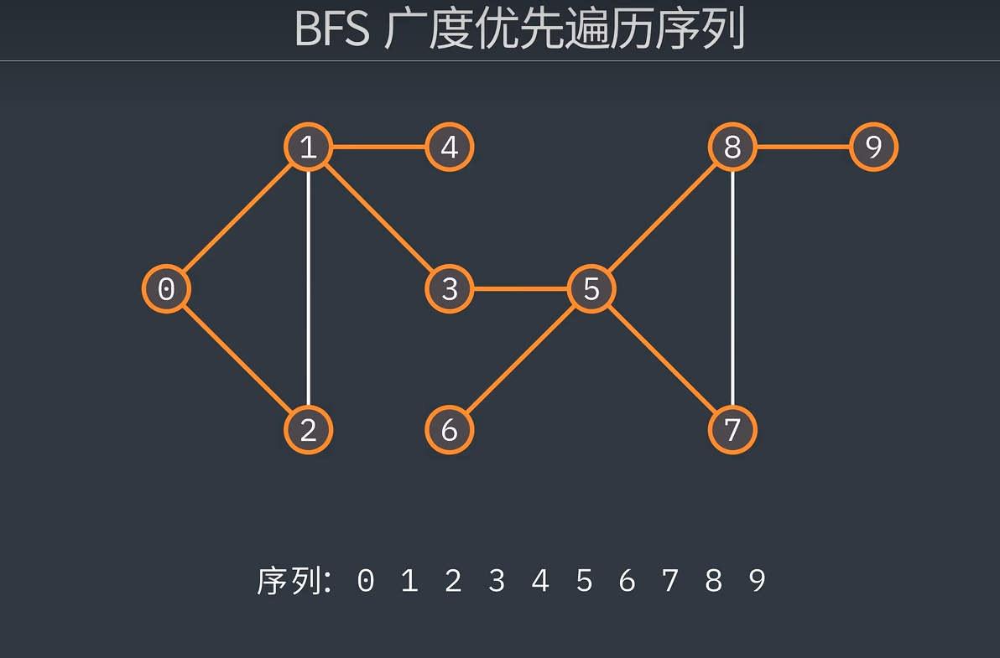

# BFS(广度优先搜索)

OIer在做题中,经常会遇到最短路径问题,连通块问题,迷宫问题等等...
那么我们应该如何处理这种题目呢

接下来给大家介绍BFS(广度优先搜索)


## 概念
>如何理解广度优先搜索


>(这里借用图码的概念图)

本质上 BFS 就是更大范围内搜索，先访问完当前顶点的所有邻接点, 之后如果下一个节点也有邻接点, 那么就接着往下搜索.

其实可以理解为 你每到一个分岔路口,就会出现几个朋友 , 帮助你去走这些分岔路. 或者理解为 "多线程" (当然只是方便理解,并不是真正意义上的多线程)
>广度优先搜索是图论中的一种算法, 他绝大多数是基于 `队列(Queue)` 实现的

在C++ 中 我们可以使用

```c++
#include <queue>
```
引入 `STL` 中的队列结构
这可以很好的帮助我们解决广搜问题

## 实际解决思路

> 当我们看到类似最短路径的问题, BFS是首选

```c++
```

